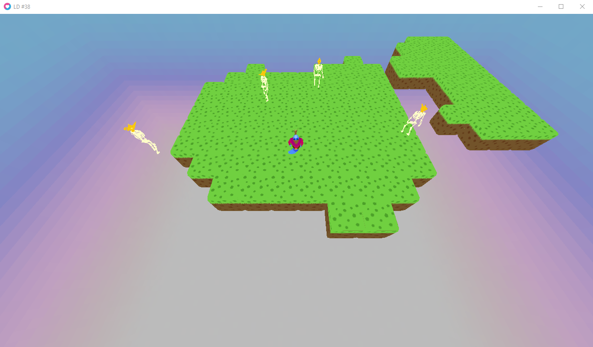
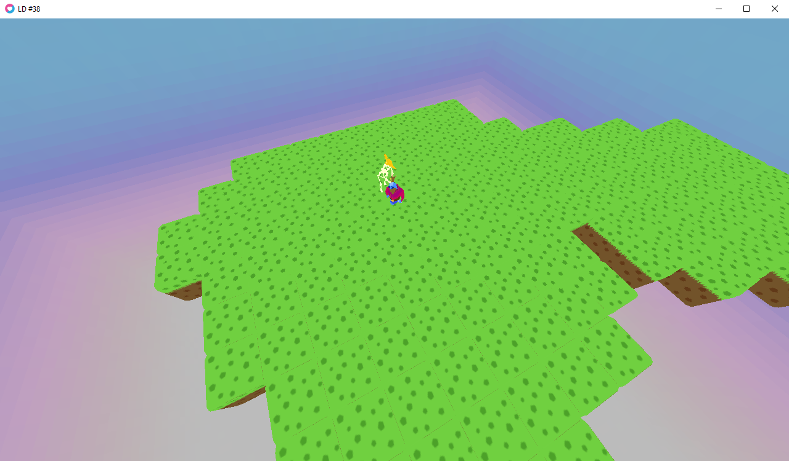
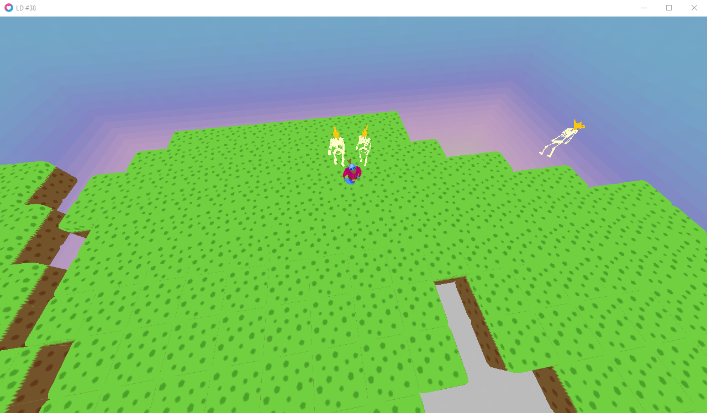
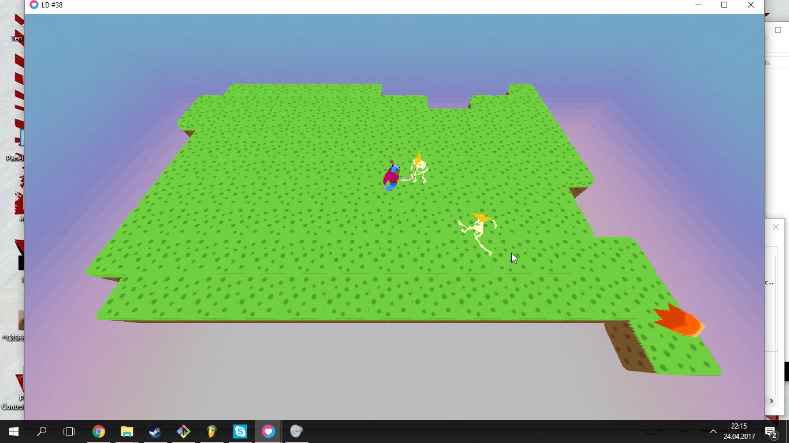

# A Minor Madness

## Abstract
I've been trapped...  
For many millenia I've been sitting here, doing nothing...  
And I'm bored. Gosh, I'm so bored.

But there may be hope.  
A tiny spark of hope, that I may find entertainment.  
Only with you, my fellow player, can I be entertained.  
**Entertain me!**

## Description
You're trapped in magic lamp. Not a desk lamp, or a standing lamp. A magic lamp, just like in that movie, Alladin. One day, while you're counting seconds, an entity appears. He wants to enslave you. Inside a prison, that is. So it's pointless for him. Anyways, you have to find him by killing everything on your path.

## Theme explanation
The theme implementation is rather discrete, so feel free to rate us 3/5 in the _theme_ category. You're inside a tiny world, on a tiny platform. The platform expands when you go into the next stage, i.e. kill all enemies.

## Controls
**Mouse**  
- LMB: move to pointer
- RMB: cast at pointer
**Keyboard**
(Keyboard layout independent)
- Q and E: rotate camera
- A and D: switch spell

## Download
Game: [itch.io](https://pi-pi3.itch.io/minor-madness)  
Source code: [github.com](https://github.com/pi-pi3/ld-38)

__  
Btw, I hate Alladin. _Firetruck_ that guy.

## Screenshots

## Changelog:
**25/04/17** - Fixed Ice Wave direction offset.
             - Background theme no longer plays twice.
